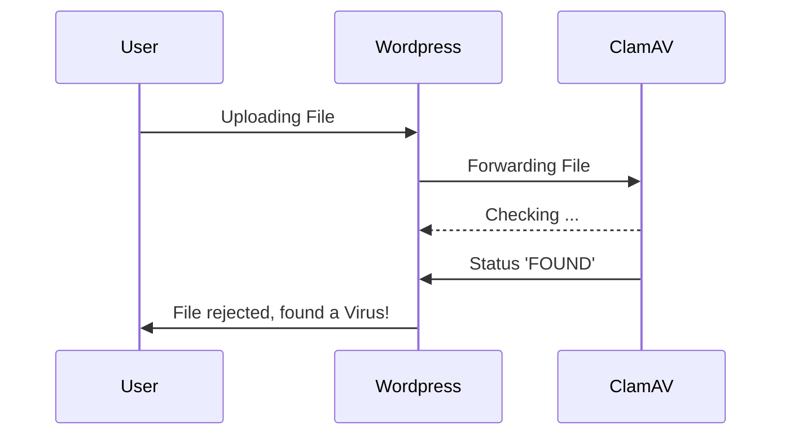

# Wieczo's Virus Scanner

A wordpress plugin to scan uploaded files for viruses with ClamAV.

---

You're invited to give [readme.txt](readme.txt) a good read, as it's the file that will be displayed in the WordPress plugin directory.

## Features

- **Upload Scan**: Scans uploaded files for viruses and malware.
- **File Upload**: Individual file check on a user-friendly admin page.
- **Full Scan**: Scans the whole WordPress installation for viruses and malware.
- **ClamAV Integration**: Sends files via a socket connection to a ClamAV service for virus scanning.
- **Easy Configuration**: The host address and port of the ClamAV service is all you need.

### Requirements

- WordPress 6.6 or higher
- A running **ClamAV service** that is accessible via a network socket (default port: 3310).
- PHP sockets must be enabled on the server.

## Detailed Description

**Wieczo's Virus Scanner** is a WordPress plugin that allows users to upload files from the WordPress admin area and scan them for viruses and malware by sending them to a ClamAV service.

Additionally, the plugin sends every upload to ClamAV first. If a virus is found, the upload is aborted.

The plugin connects to a ClamAV service using the **Host** and **Port** variables configured in the plugin settings.

### How It Works

- The plugin uses the PHP `socket` functionality to establish a connection with a ClamAV service.
- Files uploaded through the WordPress admin interface are temporarily stored on the server.
- The plugin then opens a socket connection to the configured ClamAV host and port and sends the uploaded file for analysis.
- After the scan, the plugin displays the scan results on the admin page.

#### A Diagram is Worth a Thousand Words

Simplified visualisation when a malicious file is uploaded:




## Installation

### Manual Installation:

1. Upload the `wieczos-virus-scanner` directory to your WordPress installation's `/wp-content/plugins/` directory.
2. Activate the plugin in the WordPress Admin area under "Plugins."
3. Configure the ClamAV service under **Settings -> ClamAV Settings** (enter the host and port of the ClamAV service).

## Configuration

After activating the plugin, you can configure the connection information for your ClamAV service as follows:

1. Go to **Settings -> ClamAV Scanner**.
2. Enter the **Host** and **Port** of your ClamAV service, for example:
    - **Host**: `127.0.0.1` (if the service is running locally)
    - **Port**: `3310` (default port for ClamAV)

3. Optionally, you can set a **Timeout** to define the maximum wait time for the connection to the ClamAV service.

## The plugin at work

The plugin provides two ways to scan files for viruses:

### A. Upload Scan

Once the plugin is activated, it automatically scans all uploads for viruses.

### B. Upload and Scan Files as Admin

1. Navigate to **ClamAV Scanner -> File Scanner** in the WordPress admin menu.
2. Select a file you want to scan for viruses and click "Scan File."
3. The plugin sends the file via a socket to the ClamAV service, and you will receive the scan result directly in the admin dashboard.

## Development

### Local Development

1. Clone this repository into the `/wp-content/plugins/` directory of your local WordPress project:

```bash
   git clone https://github.com/wieczo/wieczos-virus-scanner.git
```

## Contributions are Welcome!

We’re excited to welcome contributors to Wieczo's Virus Scanner!
Whether you're a seasoned developer or just getting started, your input is valuable. \
You can help us by reporting bugs, suggesting new features, or improving the code. \
It’s a great way to sharpen your skills and make a real impact.

Before submitting a pull request, we encourage you to open an issue first. And discuss your plan with us 🤗 \
Of course you can always fork the repository, work on your ideas, and submit a pull request anyways.

We’ll review it as soon as possible and **work together** to make this plugin even better!

### Contributors

We want to thank all of our contributors! Here's a list of everyone who has helped make this project better:

- [Thomas Wieczorek](https://github.com/wieczo) - Project Creator
- [Simon Neutert](https://github.com/simonneutert) - Always an inspiration and contributes with his thoughts 
  and well-spoken arguments. 
